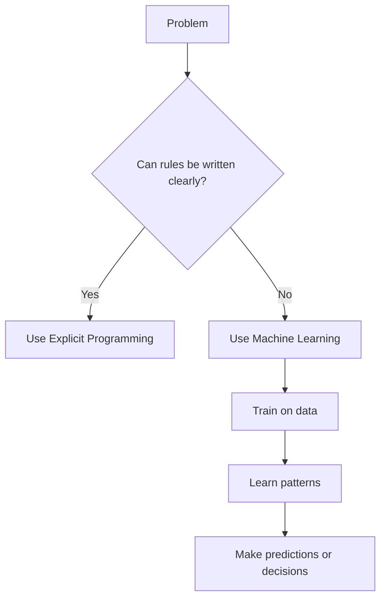

## **What is Machine Learning?**
Machine Learning (ML) is a field of computer science that uses statistical techniques to help computer systems learn from data without being explicitly programmed for every possible situation.

In simple terms, instead of writing fixed rules for all cases, a model learns patterns from examples and then uses those patterns to make predictions or decisions.

***

## **Explicit Programming**
Explicit programming means writing code manually for each situation the computer may face.

For example, if a program must react differently to many different inputs, the developer writes separate rules or conditions for each case. This works well only when all cases are known in advance and can be clearly defined.

***

## **When is Machine Learning Used?**
Machine learning is used when writing explicit rules becomes impossible, inefficient, or too limited.

| **Scenario** | **Why ML is needed** | **Example** |
|---------|------------------|---------|
| Too many possible cases | It is not practical to write rules for every case | Spam email classifier |
| Task is too difficult to define with rules | Humans can recognize patterns, but rules are hard to write | Image classification |
| Need to discover hidden patterns in data | ML can find useful relationships and trends automatically | Data mining |

### **1. We cannot write programs for everything**
Some problems have too many possible situations. Writing code for each one would take too much time and still miss new cases.

**Example:** In a spam email classifier, spam messages can appear in many forms. Instead of writing rules for every kind of spam, a machine learning model learns from past email data.

### **2. Some tasks are too difficult for rule-based programming**
Certain tasks are easy for humans but very hard to express as step-by-step rules.

**Example:** In image classification, telling whether an image contains a cat, dog, or car is difficult to solve with fixed rules because images vary in size, color, angle, and background.

### **3. Data mining and pattern discovery**
Machine learning is also used to discover patterns, trends, and hidden information from large datasets.

**Example:** A shopping platform may use ML to identify buying patterns, customer preferences, or unusual behavior from transaction data.

***

## **Simple Rule-Based vs ML Flow**

### **Explicit Programming Flow**
```text
Input + Rules written by programmer -> Output
```

### **Machine Learning Flow**
```text
Input data + Output examples -> Learning algorithm -> Model
New input + Model -> Predicted output
```

***

## **Diagram**


***

## **History of Machine Learning**
A short history of machine learning can be understood in stages:

| **Period** | **Development** |
|--------|-------------|
| Early ideas | Researchers started exploring whether machines could imitate human learning and decision-making |
| Statistics and pattern recognition era | Mathematical and statistical methods became the base for learning from data |
| Growth of computing | Better computers made it possible to train more advanced models |
| Big data era | Large datasets improved the practical success of machine learning systems |
| Modern AI era | Deep learning and large-scale models pushed ML into applications like vision, speech, and recommendation systems |

***

## **AI vs ML vs DL**
These three terms are related, but they are not the same.

- **Artificial Intelligence (AI):** The broad field of making machines perform tasks that normally require human intelligence, such as reasoning, problem solving, and decision-making.
- **Machine Learning (ML):** A subset of AI in which systems learn patterns from data instead of being fully programmed with fixed rules.
- **Deep Learning (DL):** A subset of ML that uses neural networks with many layers to learn complex patterns from large amounts of data.

| **Term** | **Meaning** | **Scope** | **Typical Use** |
|---------|-------------|-----------|-----------------|
| AI | Making machines intelligent | Broadest field | Chatbots, game agents, expert systems |
| ML | Learning from data | Subset of AI | Spam detection, recommendation systems, prediction |
| DL | Learning using deep neural networks | Subset of ML | Image recognition, speech recognition, large language models |

### **Relationship**
```text
Artificial Intelligence
    └── Machine Learning
            └── Deep Learning
```

### **Simple Understanding**
If AI is the complete goal of making machines smart, then ML is one way to achieve that goal, and DL is a more advanced way of doing ML for complex tasks.


***

## **Key Points to Remember**
- Machine learning helps systems learn from data.
- It is useful when explicit programming is not practical.
- ML is commonly used for classification, prediction, recommendation, and pattern discovery.
- Explicit programming depends on human-written rules.
- Machine learning depends on learning patterns from examples.

***

## **One-Line Revision**
Machine learning is used when problems are too complex, too large, or too pattern-based to solve using manually written rules.